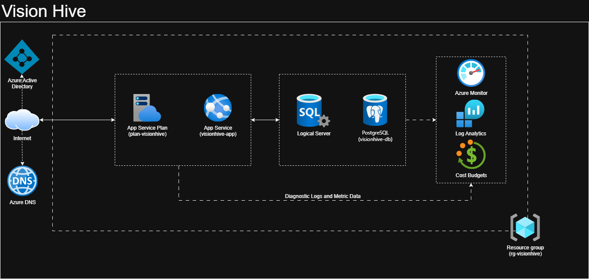
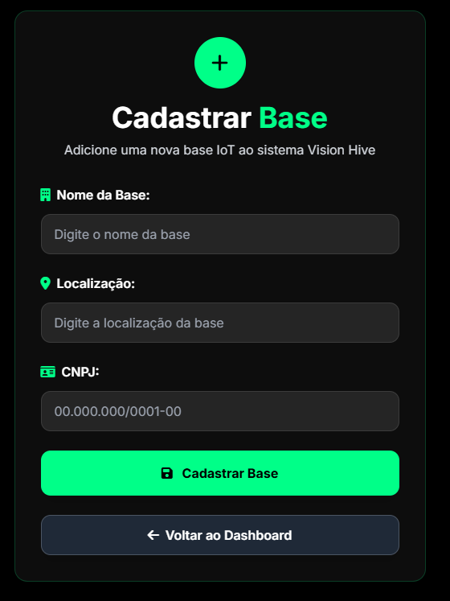
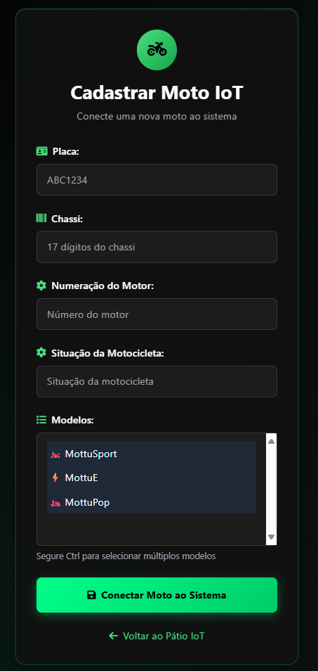
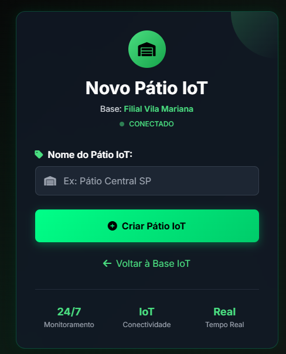

# VisionHive-DevOps

Este projeto demonstra a criação completa de uma aplicação Java Spring Boot hospedada no **Azure App Service**, conectada a um **PostgreSQL**. Inclui a criação do App Service, banco de dados, configuração de connection string e variáveis de ambiente, tudo via Azure CLI.

---

# Video demonstração Passo a Passo:
Assista ao passo a passo da configuração e deploy neste vídeo:

[https://youtu.be/O0pKMFNcDm8](https://youtu.be/O0pKMFNcDm8)

---

# Arquitetura do Sistema



## Componentes da Arquitetura

A arquitetura para a aplicação **Vision Hive** no Azure é composta pelos seguintes serviços principais:

*   **Azure Resource Group (rg-visionhive)**: Um contêiner lógico que agrupa todos os recursos relacionados à aplicação, facilitando o gerenciamento e a organização.
*   **Azure App Service Plan (plan-visionhive)**: Define o conjunto de recursos de computação que seu Web App utiliza. Neste caso, um plano gratuito para Linux, otimizado para Java 17.
*   **Azure App Service (visionhive-app)**: Onde a aplicação Java (Spring Boot) é hospedada e executada. Ele fornece a plataforma para o deploy do seu arquivo `.jar` ou via Git.
*   **Azure PostgreSQL Flexible Server (visionhive-db)**: Um serviço de banco de dados relacional totalmente gerenciado, compatível com PostgreSQL, usado para armazenar os dados da aplicação.
*   **Azure DNS**: Gerencia a resolução de nomes de domínio, garantindo que a URL da sua aplicação (`visionhive-app.azurewebsites.net`) seja acessível publicamente via Internet.
*   **Azure Active Directory (AAD)**: Embora não configurado diretamente neste setup inicial, o AAD seria a solução para gerenciamento de identidades e acesso para usuários e serviços no Azure.
*   **Azure Monitor, Log Analytics e Cost Budgets**: Ferramentas essenciais para monitoramento, análise de logs e gestão de custos da sua infraestrutura Azure em um ambiente de produção.

## Fluxo de Funcionamento e Deploy

1.  **Criação da Infraestrutura Básica**:
    *   Um **Resource Group** é criado para organizar todos os recursos da aplicação.
    *   Um **App Service Plan** é provisionado para fornecer os recursos de computação para a aplicação web.
    *   O **Web App (App Service)** é criado dentro do App Service Plan, configurado para Java 17 e habilitado para deploy via Git.
    *   Um **PostgreSQL Flexible Server** é provisionado como o banco de dados da aplicação, com acesso público habilitado para testes.

2.  **Configuração da Conectividade e Segurança**:
    *   Uma regra de **Firewall** é configurada no PostgreSQL Flexible Server para permitir que o App Service (ou qualquer IP no caso de acesso público) se conecte ao banco de dados.
    *   A **Connection String** do PostgreSQL é obtida e configurada no App Service como uma string de conexão de banco de dados, permitindo que a aplicação se conecte ao banco de dados.
    *   **Variáveis de Ambiente (App Settings)** específicas para o Spring Boot são configuradas no App Service, fornecendo os detalhes de conexão do banco de dados (URL, usuário, senha) e a estratégia DDL do Hibernate.

3.  **Deploy e Acesso da Aplicação**:
    *   O projeto Java (Spring Boot) é **buildado** localmente para gerar o arquivo `.jar executável`.
    *   O arquivo `.jar` é **deployado** no Azure App Service, tornando a aplicação disponível.
    *   A aplicação pode ser **acessada publicamente** através da sua URL (`visionhive-app.azurewebsites.net`), utilizando o Azure DNS para a resolução do nome.

## Interações Chave

*   A **Internet e o Azure DNS** direcionam as requisições dos usuários para o **App Service**.
*   O **App Service** executa a aplicação Java, que se conecta ao **PostgreSQL Flexible Server** usando as configurações de Connection String e Variáveis de Ambiente.
*   **Diagnósticos e Métricas** (como `Diagnostic Logs and Metric Data`) são enviados do App Service e do PostgreSQL para o **Azure Monitor** e **Log Analytics**, permitindo monitoramento e solução de problemas.
*   Todos esses recursos estão contidos dentro do **Resource Group**, e seu uso e custos podem ser monitorados através do **Cost Budgets**.

---

## Pré-requisitos

Para seguir este guia, você precisará ter:

*   **Azure CLI** instalado e autenticado (`az login`).
*   **Java Development Kit (JDK) 17** ou superior.
*   **Gradle** (ou Maven, dependendo do seu projeto Spring Boot) para buildar a aplicação.
*   **Git** instalado, caso utilize o deploy via `git push`.

---

## Comandos de Configuração e Deploy (Passo a Passo)

## 1. Criar Resource Group
```bash
az group create --name rg-visionhive --location brazilsouth
```

## 2. Criar App Service Plan
- Plano gratuito para Linux, preparado para Java 17.
```bash
az appservice plan create --name plan-visionhive --resource-group rg-visionhive --sku F1 --is-linux
```

## 3. Criar Web App
- Isso cria o App Service já preparado para receber o .jar ou deploy via Git.
- --deployment-local-git habilita deploy via git push.
```bash
az webapp create --resource-group rg-visionhive --plan plan-visionhive --name visionhive-app --runtime "JAVA:17-java17" --deployment-local-git
```

## 4. Criar PostgreSQL Flexible Server
- --public-network-access Enabled → acesso público (bom para testes)
```bash
az postgres flexible-server create \
  --name visionhive-db \
  --resource-group rg-visionhive \
  --location brazilsouth \
  --admin-user visionadmin \
  --admin-password 'Vision123!' \
  --sku-name Standard_B1ms \
  --tier Burstable \
  --storage-size 32 \
  --version 15 \
  --public-access all
```

## 5. Configurar firewall para permitir acesso do App Service
- Aqui estou liberando para todos (facilita a Sprint).
- Se quiser, pode restringir para o IP do App Service.
```bash
az postgres flexible-server firewall-rule create \
  --resource-group rg-visionhive \
  --name visionhive-db \
  --rule-name AllowAppService \
  --start-ip-address 0.0.0.0 \
  --end-ip-address 255.255.255.255
```

## 6. Configurar Connection String no App Service
### Pegue a string do Flexible Server:
```bash
az postgres flexible-server show-connection-string \
  --server-name visionhive-db \
  --database-name postgres \
  --admin-user visionadmin \
  --admin-password 'Vision123!'
```

### Configure no App Service:
```bash
az webapp config connection-string set \
  --resource-group rg-visionhive \
  --name visionhive-app \
  --connection-string-type PostgreSQL \
  --settings 'DefaultConnection=jdbc:postgresql://visionhive-db.postgres.database.azure.com:5432/postgres?user=visionadmin&password=Vision123\!&sslmode=require'
```

### Verificar a connection string:
```bash
az webapp config connection-string list \
  --resource-group rg-visionhive \
  --name visionhive-app
```

## 7. Configurar variáveis de ambiente (App Settings) para Spring Boot
```bash
az webapp config appsettings set \
  --resource-group rg-visionhive \
  --name visionhive-app \
  --settings SPRING_DATASOURCE_URL='jdbc:postgresql://visionhive-db.postgres.database.azure.com:5432/postgres' \
             SPRING_DATASOURCE_USERNAME='visionadmin' \
             SPRING_DATASOURCE_PASSWORD='Vision123!' \
             SPRING_JPA_HIBERNATE_DDL_AUTO='update'
```

### Verificar as variáveis de ambiente:
```bash
az webapp config appsettings list \
  --resource-group rg-visionhive \
  --name visionhive-app
```

## 8. Buildar o projeto:
```bash
gradle build
```

## 9. Deploy do .jar no App Service
```bash
az webapp deploy \
  --resource-group rg-visionhive \
  --name visionhive-app \
  --type jar \
  --src-path build/libs/VisionHive-0.0.1-SNAPSHOT.jar
```

## 10. Acessar o app:
```text
visionhive-app.azurewebsites.net
```

## Credenciais de Teste da Aplicação

Utilize as seguintes contas para testar o fluxo da aplicação:

#### Conta de Admin (Acesso total no sistema):
*   **Usuário**: adminCM
*   **Senha**: admin123

#### Conta de Operador (Acesso somente na organização das motos):
*   **Usuário**: operadorCm
*   **Senha**: operador123

## Imagens do Projeto e critérios de aceite

### Bases  
- **Cadastro de Bases:**
- - O campo **nome** não pode estar em branco.  
- O campo **bairro** não pode estar em branco.  
- O campo **cnpj**:  
  - Não pode estar em branco.  
  - Deve ter **exatamente 14 dígitos**.  
- A filial pode conter múltiplos **pátios** associados.
  


### Motocicletas  
- **Cadastro de Motos:**
- O campo **placa**:  
  - Não pode estar em branco.  
  - Deve ter **exatamente 7 caracteres**.  
- O campo **chassi**:  
  - Não pode estar em branco.  
  - Deve ter **exatamente 17 caracteres**.  
- O campo **numeração do motor**:  
  - Não pode estar em branco.  
  - Deve ter entre **9 e 17 caracteres**.  
- O campo **modelo da moto**:  
  - Não pode estar em branco.  
  - Deve ser **MottuSport**, **MottuE** ou **MottuPop**.  
- O campo **situação** não pode estar vazio.
- Toda motocicleta deve estar associada a um **pátio**.
  

 
### Pátios  
- **Cadastro de Pátios:**
- O campo **nome** não pode estar em branco.  
- Todo pátio deve estar associado a uma **filial (branch)**.  
- Um pátio pode conter múltiplas **motocicletas**.  



---

## Integrantes

| Nome                   | RM       |
|------------------------|----------|
| João Victor Michaeli   | RM555678 |
| Larissa Muniz          | RM557197 |
| Henrique Garcia        | RM558062 |

---
