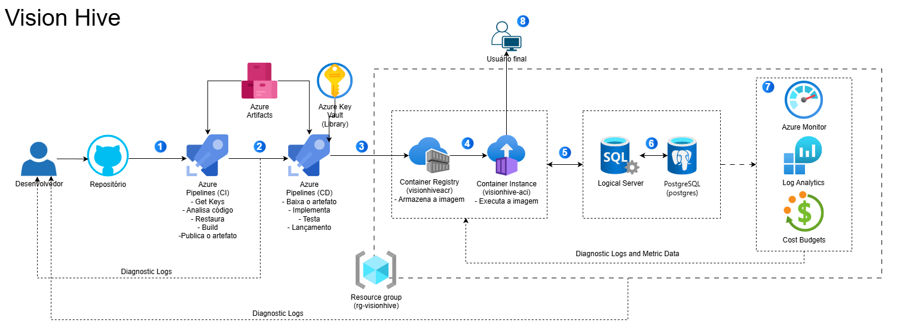
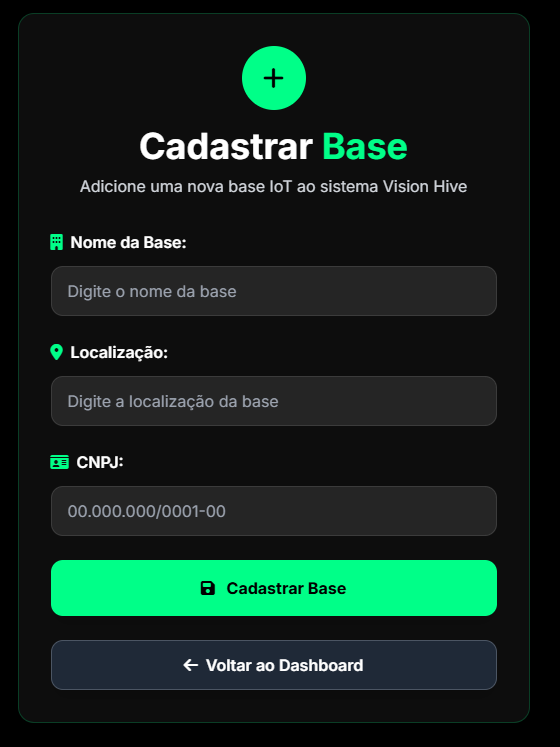
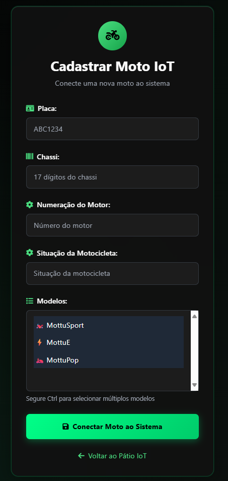
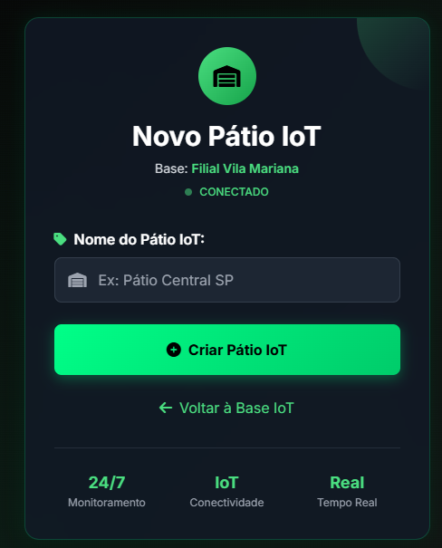

# VisionHive-DevOps

Este projeto demonstra a criação completa de uma aplicação Java Spring Boot hospedada no **Azure Container Instance**, conectada a um **PostgreSQL**. Inclui a criação do grupo de recurso, container registry, container instance banco de dados, configuração de connection string e variáveis de ambiente.

Além disso, esse repositório possui o .azure-pipelines.yml, ou seja, implementado com CI/CD.

---

# Video demonstração Passo a Passo:
Assista ao passo a passo da configuração e deploy neste vídeo:

[https://youtu.be/FOvRFe8t4co](https://youtu.be/FOvRFe8t4co)

# Link para acessar a aplicação:

[http://visionhive.brazilsouth.azurecontainer.io:8080/login]

## Login para testes como admin

- Login:
  ```adminCM```
- Senha:
  ```admin123```

## Login para testes como operador

- Login:
  ```operadorCM```
- Senha:
  ```operador123```

---

# Arquitetura do Sistema



## Componentes da Arquitetura

A arquitetura para a aplicação **Vision Hive** no Azure é composta pelos seguintes serviços principais:

*   **Azure Resource Group (rg-visionhive)**: Um contêiner lógico que agrupa todos os recursos relacionados aos containers, facilitando o gerenciamento e a organização.
*   **Azure PostgreSQL Flexible Server (visionhive-db)**: Um serviço de banco de dados relacional totalmente gerenciado, compatível com *PostgreSQL*, usado para armazenar os dados da aplicação.
*   **Repositório GitHub**: Para ter acesso as modificações do projeto, ou seja, quando há mudança em qualquer arquivo da branch Main, a pipeline dispara, atualizando a aplicação.
*   **Azure Pipelines (CI)**: Integração contínua, onde ele fica designado a recuperar as variáveis de ambiente cadastradas no *library(keys)*, acessar o meu *Dockerfile* gerando o artefato e o publica no *container registry*.
*   **Azure Pipelines (CD)**: Deploy contínuo, onde fica responsável para baixar o artefato gerado no build, implementa a imagem publicada no container registry, gera o *container instance* e implementa a imagem a ele, gerando um *FQDN* (link para acesso da aplicação na web).
*   **Container Registry**: Container para armazenar a *imagem* gerada no build da *pipeline*.
*   **Container Instance**: Container para se relacionar a *imagem* gerada no *container registry* e a publicando, a tornando disponivel para acesso a rede, sendo a ponte entre o *usuário final* e a aplicação.
*   **Logical Server**: Servidor para armazenar o *banco de dados postgreSQL*.
*   ** PostgreSQL**: Banco de dados da aplicação, responsável por salvar todas as *querys* do *flyway* do *spring*.
*   **Azure Monitor, Log Analytics e Cost Budgets**: Ferramentas essenciais para monitoramento, análise de logs e gestão de custos da sua infraestrutura Azure em um ambiente de produção.

## Fluxo de Funcionamento e Deploy

1.  **Criação da Infraestrutura Básica**:
    *   Um **Resource Group** é criado para organizar todos os recursos da aplicação.
    *   Um **Container Registry** armazena a imagem da aplicação gerada pela pipeline.
    *   Um **Container Instance** recupera a imagem do container registry e a publica para acesso web.
    *   Um **PostgreSQL Flexible Server** é provisionado como o banco de dados da aplicação, com acesso público habilitado para testes.

2.  **Configuração da Conectividade e Segurança**:
    *   Uma regra de **Firewall** é configurada no PostgreSQL Flexible Server para permitir que a aplicação web gerada pelo container instance (ou qualquer IP no caso de acesso público) se conecte ao banco de dados.
    *   A **Connection String** do PostgreSQL é obtida e configurada na library (armazenamento de keys) como uma string de conexão de banco de dados, e consumida na pipeline, permitindo que a aplicação se conecte ao banco de dados.

3.  **Deploy e Acesso da Aplicação**:
    *   O projeto Java (Spring Boot) é **buildado** pelo container registry via pipeline.
    *   O arquivo `.jar` é **consumido** no container instance, gerando um FQDN, tornando a aplicação disponível.
    *   A aplicação pode ser **acessada publicamente** através da sua URL (`http://visionhive.brazilsouth.azurecontainer.io:8080/login`).

## Interações Chave

*   A **Internet** direcionam as requisições dos usuários para o **Container instance**.
*   O **Container instance** executa a aplicação Java, que se conecta ao **PostgreSQL Flexible Server** usando as configurações de Connection String e Variáveis de Ambiente.
*   **Diagnósticos e Métricas** (como `Diagnostic Logs and Metric Data`) são enviados do Container registry, Container instance e do PostgreSQL para o **Azure Monitor** e **Log Analytics**, permitindo monitoramento e solução de problemas.
*   Todos esses recursos estão contidos dentro do **Resource Group**, e seu uso e custos podem ser monitorados através do **Cost Budgets**.

---

## Credenciais de Teste da Aplicação

Utilize as seguintes contas para testar o fluxo da aplicação:

#### Conta de Admin (Acesso total no sistema):
*   **Usuário**: adminCM
*   **Senha**: admin123

#### Conta de Operador (Acesso somente na organização das motos):
*   **Usuário**: operadorCm
*   **Senha**: operador123

## Imagens do Projeto e critérios de aceite

### Bases  
- **Cadastro de Bases:**
- - O campo **nome** não pode estar em branco.  
- O campo **bairro** não pode estar em branco.  
- O campo **cnpj**:  
  - Não pode estar em branco.  
  - Deve ter **exatamente 14 dígitos**.  
- A filial pode conter múltiplos **pátios** associados.
  


### Motocicletas  
- **Cadastro de Motos:**
- O campo **placa**:  
  - Não pode estar em branco.  
  - Deve ter **exatamente 7 caracteres**.  
- O campo **chassi**:  
  - Não pode estar em branco.  
  - Deve ter **exatamente 17 caracteres**.  
- O campo **numeração do motor**:  
  - Não pode estar em branco.  
  - Deve ter entre **9 e 17 caracteres**.  
- O campo **modelo da moto**:  
  - Não pode estar em branco.  
  - Deve ser **MottuSport**, **MottuE** ou **MottuPop**.  
- O campo **situação** não pode estar vazio.
- Toda motocicleta deve estar associada a um **pátio**.
  

 
### Pátios  
- **Cadastro de Pátios:**
- O campo **nome** não pode estar em branco.  
- Todo pátio deve estar associado a uma **filial (branch)**.  
- Um pátio pode conter múltiplas **motocicletas**.  



---

## Integrantes

| Nome                   | RM       |
|------------------------|----------|
| João Victor Michaeli   | RM555678 |
| Larissa Muniz          | RM557197 |
| Henrique Garcia        | RM558062 |

---
